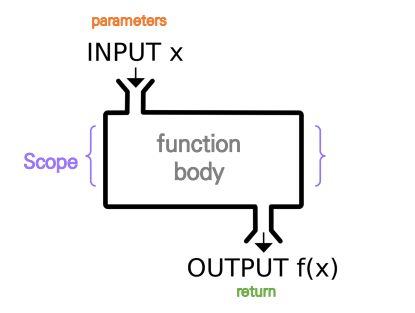

# 사용자 함수 정의
## 함수 기본 구조

- 선언과 호출(define & call)
- 입력(Input)
- 범위(Scope)
- 결과값(Output)

## 선언과 호출
> def 키워드 활용
>
> 들여쓰기를 통해 Function body를 작성
```python
def foo():
    return True
def add(x, y):
    return x + y

foo()
add(2, 3)
```

## 함수의 결과값(Output)
> 반드시 하나만 return한다.
- 명시적인 return이 없으면 None을 반환
- 함수는 return과 동시에 실행이 종료
- 여러개를 반환하고 싶다면 tuple로 반환 가능

## 함수의 입력(Input)
- Parameter: 함수를 실행할 때, 함수 내부에서 사용되는 식별자
- Argument: 함수를 호출할 때, 함수 이름 옆 소괄호에 넣어주는 값
```python
def function(ham):  # parameter : ham
    return ham

function('spam')    # argument: 'spam'
```
- 필수 Argument: 반드시 전달되어야 하는 argument
- 선택 Argument: 값을 전달하지 않아도 되는 경우는 기본 값이 전달
- Positional Arguments
    - def add(x, y): -> add(2, 3)
- Keyword Arguments
    - def add(x, y): -> add(x=2, y=5) or add(2, y=5)
- Default Arguments Values
    - def add(x, y=0): -> add(2)
### **정해지지 않은 개수**의 arguments
- 여러개의 Positional Arguments를 하나의 필수 parameter로 받아서 사용.
- Arguments가 튜플로 묶여 처리, parameter에 *를 붙여서 표현
```python
def add(*args):
    for arg in args:
        print(arg)
add(2)
add(2, 3, 4, 5)
```
### 정해지지 않은 개수의 keyword arguments
- 함수가 임의의 개수 Argument를 Keyword Argument로 호출 될 수 있도록 지정
- Argument들은 딕셔너리로 묶이고, parameter에 **를 붙여 표현
```python
def family(**kwargs):
    for key, value in kwargs:
        print(key, ":", value)
family(father='John', mother='Jane', me='John Jr.')
```
## 함수의 범위(Scope)
### 함수의 scope
- scope
    - global scope: 코드 어디에서든 참조 가능
    - local scope: 함수가 만든 scope. 함수 내부에서만 참조 가능
### 객체 수명주기
- 객체는 각자의 수명주기(lifecycle) 존재
    - built-in scope: 파이썬이 실행된 이후 영원히 유지
    - global scope: 모듈이 호출된 시점 이후 혹은 인터프리터가 끝날 때까지 유지
    - local scope: 함수가 호출될 때 생성, 함수가 종료될 때까지 유지
### 이름 검색 규칙(Name Resolution)

- 파이썬에서 사용되는 이름(식별자)들은 이름공간(namespace)에 저장되어 있음
- 아래와 같은 순서로 이름을 찾음(LEGB Rule)
    - Local scope: 함수
    - Enclosed scope: 특정 함수의 상위 함수
    - Global scope: 함수 밖 변수, Impore 모듈
    - Built-in scope: 파이썬 안에 내장되어 있는 함수 또는 속성
- 함수 밖에서는 함수 내 변수에 접근 불가
- 함수 안에서는 바깥 변수에 접근 가능하나 수정 불가
### global 문
```python
a = 10
def func1():
    global a    # 나열된 식별자(이름)가 global variable임을 선언
    a = 3

print(a) # 10
func1()
print(a) # 3    global키워드 없었다면 local의 a 변수가 생성
```
- global에 나열된 이름은 같은 코드블록에서 global 앞에 등장 불가
- global에 나열된 이름은 parameter, for 루프 대상, 클래스/함수 정의 등으로 정의되지 않아야 한다.