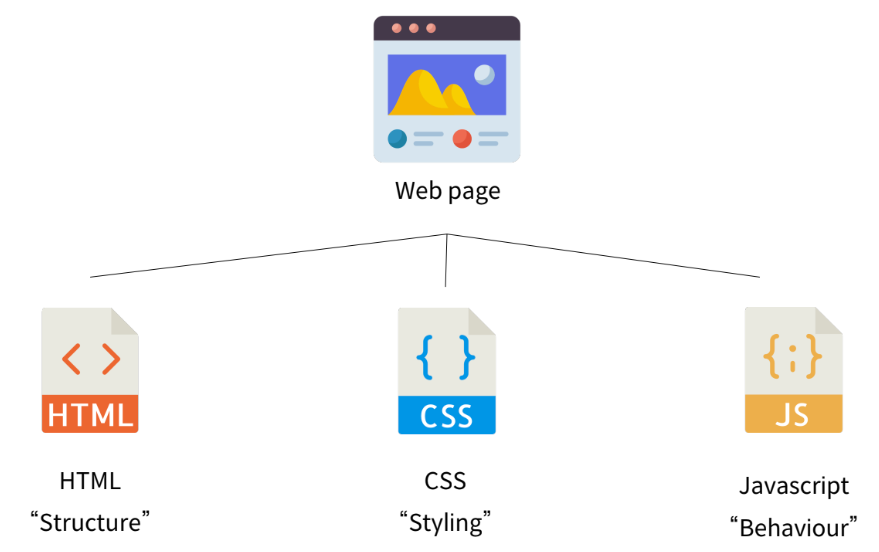

# 01. Web - Fundamentals of HTML and CSS
## 1. Introduction of web page
- World Wide Web: 인터넷으로 연결된 컴퓨터들이 정보를 공유하는 거대한 정보 공간
- Web site: 인터넷에서 여러개의 **Web page**가 모인 것. 사용자들에게 정보나 서비ㅓ스를 제공하는 공간
- Web page: HTML, CSS, JavaScript 등의 웹 기술을 이용하여 만들어진, 하나의 인터넷 문서



## 2. Structuring the web
### 2.1 Introduction to HTML
> HTML: HyperText Markup Language (웹 페이지의 의미와 구조를 정의하는 언어)

- Hypertext
    - 웹 페이지를 다른 페이지로 연결하는 링크
    - 참조를 통해 사용자가 한 문서에서 다른 문서로 즉시 접근할 수 있게 하는 텍스트
    - 기존에는 선형적으로 (1 -> 2 -> 3) 이동했어야 함.

- Markup Language
    - 태그 등을 이용하여 문서나 데이터의 구조를 명시하는 언어(HTML, Markdown 등)

### 2.2 Structure of HTML
- HTML Element

    - 하나의 요소는 여는 태그와 닫는 태그 그리고 그 안의 내용으로 구성
    - 닫는 태그는 태그 이름 앞에 슬래시(/)가 포함. 닫는 태그가 없는 태그도 존재

- HTML Attirbutes

    - 규칙
        - 요소 이름 다음에 바로 오는 속성은 요소 이름과 속성 사이에 공백이 있어야 함
        - 하나 이상의 속성들이 있다면 속성 사이에 공백으로 구분
        - 속성 값은 열고 닫는 따옴표로 감싸야 함
    - 목적
        - 나타내고 싶지 않지만 추가적인 기능, 내용을 담고 싶을 때 사용
        - CSS가 해당 요소를 선택하기 위한 값으로 활용

- HTML 문서의 구조
```html
<!DOCTYPE html>
<html>
<head>
  <meta charset="UTF-8">
  <title>컨텐츠</title>
</head>
<body>
  <p>This is my page</p>
  <a href="https://www.google.com/">구글로 이동!</a>
  <!-- a: 앵커, 하이퍼링크를 담당 -->
  
  <!-- 이미지는 자기 자신이 컨텐츠이기 때문에 닫는 주석이 없음 -->
  
</body>
</html>
 
<!-- 주석 -->
```
- vscode opening 확장프로그램 있으면 alt+B로 바로 html파일 열기 가능
- html 작성할 때 !누르고 tab누르면 자동으로 서식 주어짐.

### 2.3 Text Structure
- Heading & Paragraphs: h1~6, p
```html
<h1>메인 제목</h1>
<h2>중제목</h2>
<p>내 페이지</p>
```
- Lists: ol, ul, li (ordered, unordered)
```html
<ol>
<li>파이썬</li>
<li>알고리즘</li>
</ol>
<ul>
<li>파이썬</li>
<li>알고리즘</li>
</ul>
```
- Emphasis & Importance: em, strong
```html
<p>이건 <em>emphasis</em> 입니다.</p>
<p>이건 <strong>strong</strong> 입니다.</p>
```
- 줄바꿈: br
```html
<p>This is<br>my page</p>
```
## 3. Styling the web
### 3.1 Introduction to CSS
> CSS(Cascading Style Sheet): 웹 페이지의 디자인과 레이아웃을 구성하는 언어 (위에서 아래로)
```CSS
h1 {                   /* 선택자 */
  color: blue;         /* 선언 */
  font-size: 15px;     /* 속성, 값 */
/* ; 세미콜론 필요 */
}
```
- CSS 적용 방법
    1. 인라인(Inline) 스타일
        - 유지보수에 어려움이 있어 사용하지 않음
        ```html
        <!DOCTYPE html>
        <html lang="en">
        <head>
        ...
        </head>
        <body>
          <h1 syle="color: blue; background-color: yellow;">Hello World!</h1>
        </body>
        </html>
        ```
    2. 내부(Internal) 스타일 시트
         ```html
        <!DOCTYPE html>
        <html lang="en">
        <head>
        ...
          <title>Document</title>
          <style>
            h1 {
              color: blue;
              background-color: yellow;
            }
            </style>
        </head>
        <body>
          <h1>Hello World!</h1>
        </body>
        </html>
        ```
    3. 외부(External) 스타일 시트
        - 별도의 CSS 파일 생성 후 불러오기
         ```html
        <!DOCTYPE html>
        <html lang="en">
        <head>
        ...
          <link rel="stylesheet" href="style.css">
          <title>Document</title>
        </head>
        <body>
          <h1>Hello World!</h1>
        </body>
        </html>
        ```
        ```css
        /* syle.css */
        h1 {
          color: blue;
          background-color: yellow;
        }
        ```

### 3.2 Select elements
- 기본 선택자
    - 전체(*) 선택자
        ```css
        * {
          color: red
        }
        ```
    - 요소(tag) 선택자
        ```css
        h3,
        h4 {
          color: blue;
        }
        ```
    - 클래스(class) 선택자
        ```css
        .green {
          color: green;
        }
        ```
    - 아이디(id) 선택자
        - 문서에는 주어진 아이디를 가진 요소가 하나만 있어야 함
        ```css
        #purple {
          color: purple;
        }
        ```
    - 속성(attr) 선택자

- 결합자 (Combinators)
    - 자손 결합자(" "(space))
        ```css
        .green li {
          color: brown;
        }
        ```
    - 자식 결합자(>)
        - 첫 번째 요소의 직계 자식만 선택
        ```css
        .green > span {
          font-size: 50px;
        }
        ```

### 3.3 Cascade & Specificity
> 계단식 & 우선순위: 동일한 요소에 적용 가능한 같은 스타일을 두 가지 이상 작성 했을 때 어떤 규칙이 적용되는지 결정하는 것

- Cascade (계단식)
    - 동일한 우선순위를 갖는 규칙이 적용될 때 CSS에서 마지막에 나오는 규칙이 사용됨
    ```CSS
    h1 {
        color: red;
    }
    h1 {
        color: blue;
    }
    /* blue가 적용 */
    ```
- Specificity (우선순위)
    - 선택자 별로 정해진 우선순위 점수에 따라 점수가 높은 규칙이 사용
    ```CSS
    .make-red {
        color: red;
    }
    h1 {
        color: blue;
    }
    /* red가 적용 */
    ```
    - 우선순위
        1. Importance
            - !important
            - 구조를 무시하고 모든 우선순위 점수 계산을 무효화하는 가장 높은 우선순위.
            - 반드시 필요한 경우가 아니면 절대 사용하지 말 것.
        2. 우선 순위
            - 인라인 스타일 > id 선택자 > class 선택자 > 요소 선택자
        3. 소스 코드 순서

- 상속
    - 기본적으로 CSS는 상속을 통해 부모 요소의 속성을 자식에게 상속
    - 이를 이용해 코드의 재사용성을 높임
- 상속되는 속성
    - Text 관련 요소(font, color, text-align)
    - opacity
    - visibility 등
- 상속되지 않는 속성
    - Box model 관련 요소(width, height, margin, padding, border, box-sizing, display)
    - position 관련 요소(position, top/right/bottom/left, z-index) 등
```CSS
.parent {
  /* 상속 O */
  color: red;
  
  /* 상속 X */
  border: 1px solid black;  
}
```
```html
<ul class="parent">
  <li class="child">Hello</li>
  <li class="child">Bye</li>
</ul>
```

## 참고
### HTML
- HTML 요소 이름은 대소문자를 구분하지 않지만 소문자 사용을 권장
- HTML 속성의 따옴표는 작은 따옴표와 큰 따옴표를 구분하지 않지만 큰 따옴표 권장
- HTML은 프로그래밍 언어와 달리 에러를 반환하지 않기 때문에 작성에 주의(디버깅이 어렵다)

### CSS
- 인라인 스타일 사용하지 않기
- 속성은 되도록 class만 사용
- CSS 상속 여부는 MDN 문서에서 확인